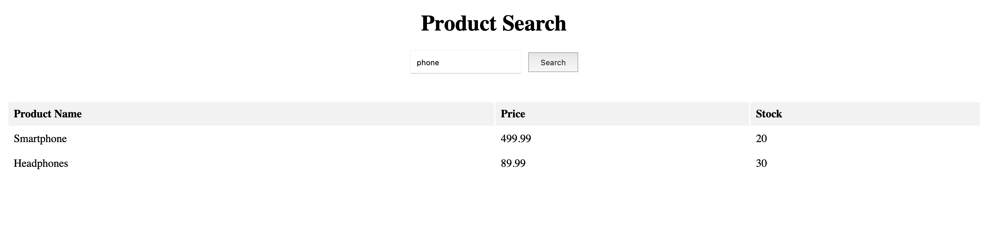

# Example of an SQL-injection attack and prevention



This application is a simple example of an SQL-injection attack and prevention of such attack. The application is a simple product search application that allows users to search for products by name. The application is built using Angular and .NET Core. The application uses a local MSSQL database to store product information.


## Prerequisites

Before you begin, ensure you have met the following requirements:
- Docker (optional, for containerization)
- .NET SDK (specify version)
- Angular CLI (specify version)
- MSSQL local database

## Getting Started

These instructions will get you a copy of the project up and running on your local machine for development and testing purposes.

### Installation

1. **Clone the repository:**
   ```bash
   git clone https://github.com/mols14/DBD_SQL_example
   cd DBD_SQL_example


2. **Set up the backend (C# .NET):**
   Navigate to the backend directory and build the .NET solution:
   ```bash
   cd backend
   dotnet restore
   dotnet build
   ```

3. **Set up the frontend (Angular):**
   Navigate to the frontend directory and install dependencies:
   ```bash
   cd Storefrontend
   npm install
   ```

4. **Database setup:**
   Ensure your local MSSQL database is running. You can use Docker to run a MSSQL container:
   ```bash
   docker run -e "ACCEPT_EULA=Y" -e "SA_PASSWORD=yourStrong(!)Password" -p 1433:1433 -d mcr.microsoft.com/mssql/server:2019-latest
   ```
   Update the connection string in your application settings.

### Running the Application

1. **Start the backend:**
   ```bash
   dotnet run
   ```

2. **Start the frontend:**
   Open a new terminal window and run:
   ```bash
   ng serve
   ```
   Navigate to `http://localhost:4200/` to view the application.


## Contributing

Steps to follow if someone wants to contribute to the project:
1. Fork the Project
2. Create your Feature Branch (`git checkout -b feature/AmazingFeature`)
3. Commit your Changes (`git commit -m 'Add some AmazingFeature'`)
4. Push to the Branch (`git push origin feature/AmazingFeature`)
5. Open a Pull Request

## Contact

Nicklas Jørgensen – [@nicklas0110](https://github.com/nicklas0110)

Mathias Mols Thim – [@mols14](https://github.com/mols14)

Project Link: [https://github.com/mols14/DBD_SQL_example)
